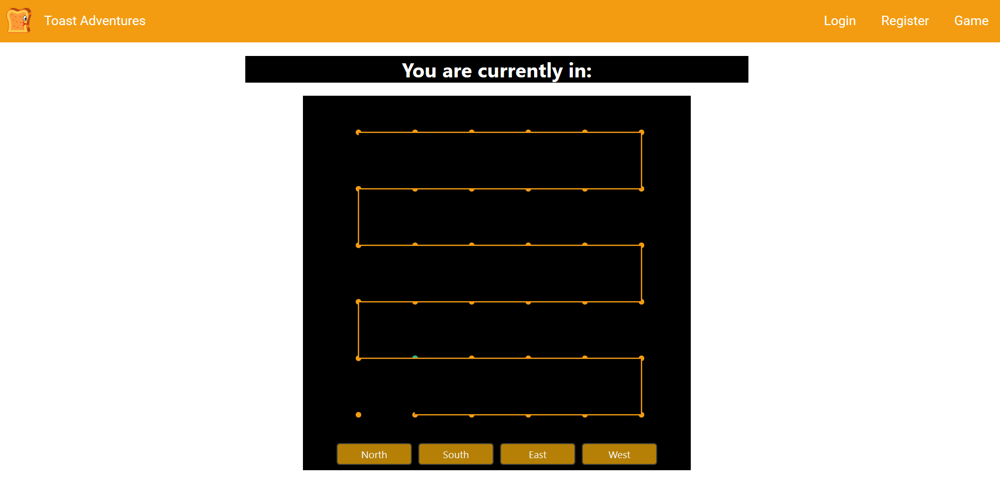
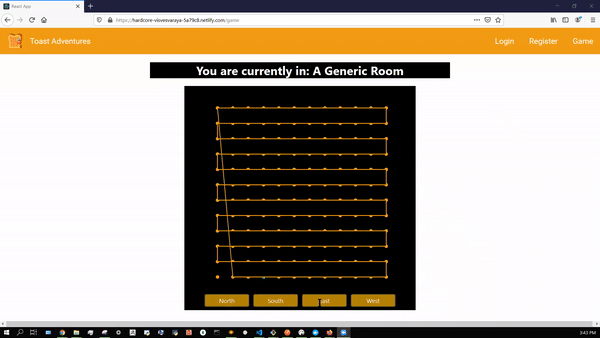

### Instructions to run existing files:
If using Yarn:
If Yarn is not installed:
###https://classic.yarnpkg.com/en/docs/install/#windows-stable
###https://chocolatey.org/install
```
Set-ExecutionPolicy Bypass -Scope Process -Force; [System.Net.ServicePointManager]::SecurityProtocol = [System.Net.ServicePointManager]::SecurityProtocol -bor 3072; iex ((New-Object System.Net.WebClient).DownloadString('https://chocolatey.org/install.ps1'))

choco install yarn

curl -o- -L https://yarnpkg.com/install.sh | bash

export PATH="$HOME/.yarn/bin:$HOME/.config/yarn/global/node_modules/.bin:$PATH"

```


Navigate to the mud folder in front-end repo
```
yarn install
yarn start
```



